# Remote control for small trains

## Working principle

Use an Pi Pico W to send RF OOSK signals to a decoder
to control various trains (depending on the frequency)
to move.

### Plan
1. Pi Pico W generates a square signal that is modulated into a 400MHz carrier via OOSK containing:
    - A long iddle state so the frame, missing-pulse detector can start sampling data to decode
    - n pulses (1 to 8) that gets decoded by a johnson counter into 1 of 8 possible outputs

2. The signal gets to the receiver board and is demodulated, recovering the original signal
3. The extracted signal passes through a frequency window detector to check if the frequency
corresponds to the given channel
4. If it passes the filter, it goes to a frame detector circuit that activates the counter
5. A missing pulse detector detects when all pulses have arrived and disables the counter
reseting it, as well as asserting the output enable to make the corresponding output visible.

```mermaid
graph TD
  %% Transmitter Side
  A[Pico W] -->|Generates square wave| B[OOSK Modulator<br/> 400MHz Carrier]
  B --> C[Encoded Signal<br/> Idle + 1–8 Pulses ]

  %% Receiver Side
  C --> D[RF Demodulator]
  D --> E[Recovered Baseband Signal]

  %% Signal Processing
  E --> F{Freq Window<br/>Detector}
  F -- Pass --> G[Frame Detector<br/>Enables Counter]
  G --> H[Johnson Counter]
  H --> I[1 of 8 Outputs]

  %% Frame End
  G --> J[Missing Pulse Detector]
  J -->|Disable + Reset| H
  J -->|Assert Enable| K[Output Enable Logic]
  K --> I

```

